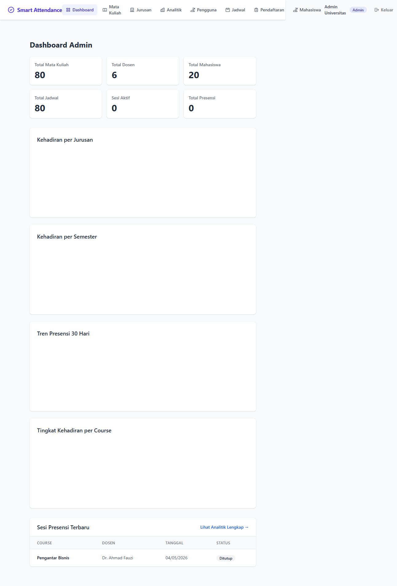
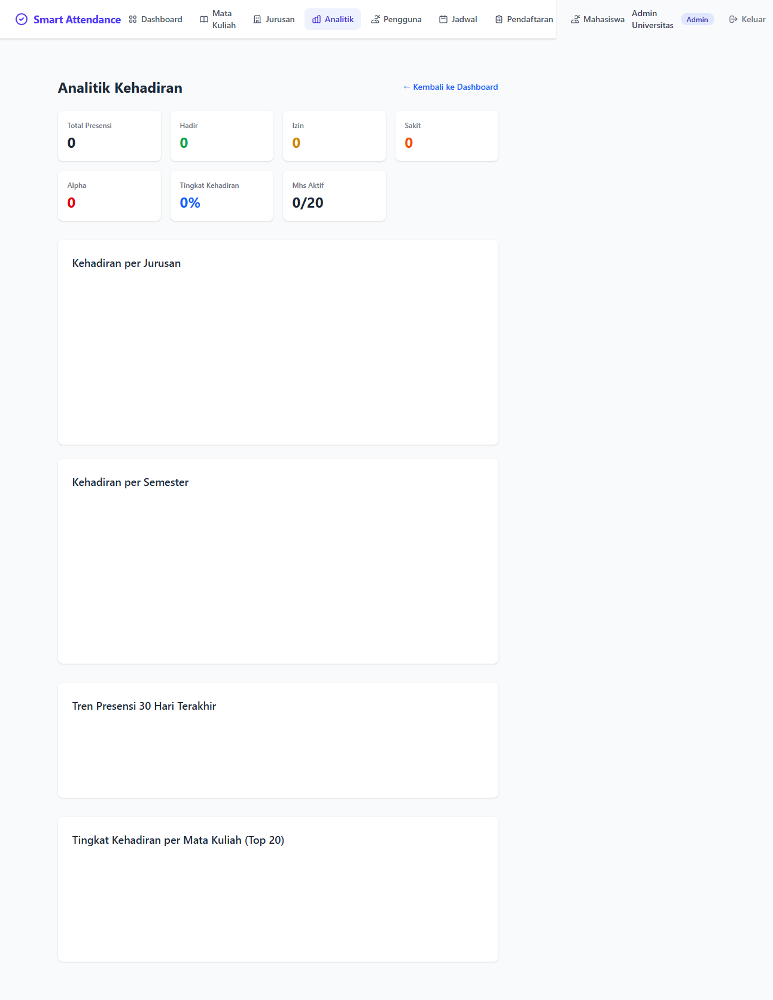
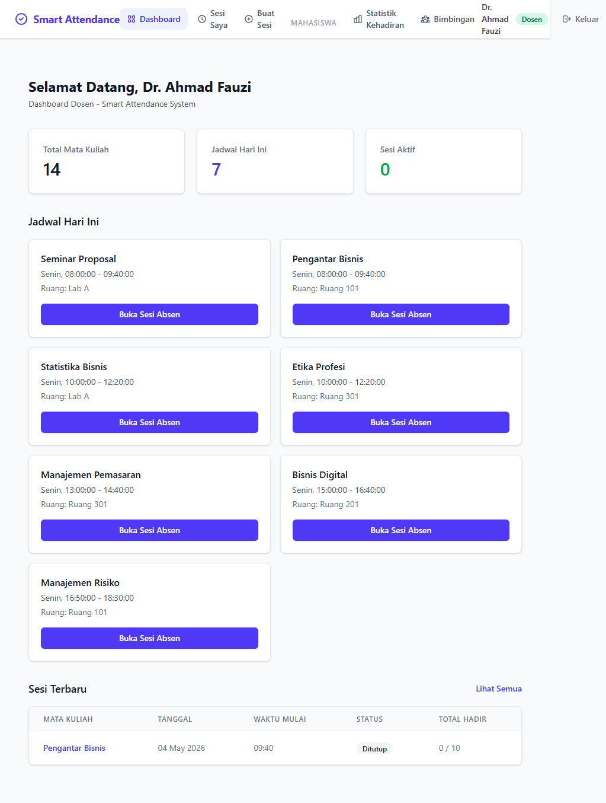
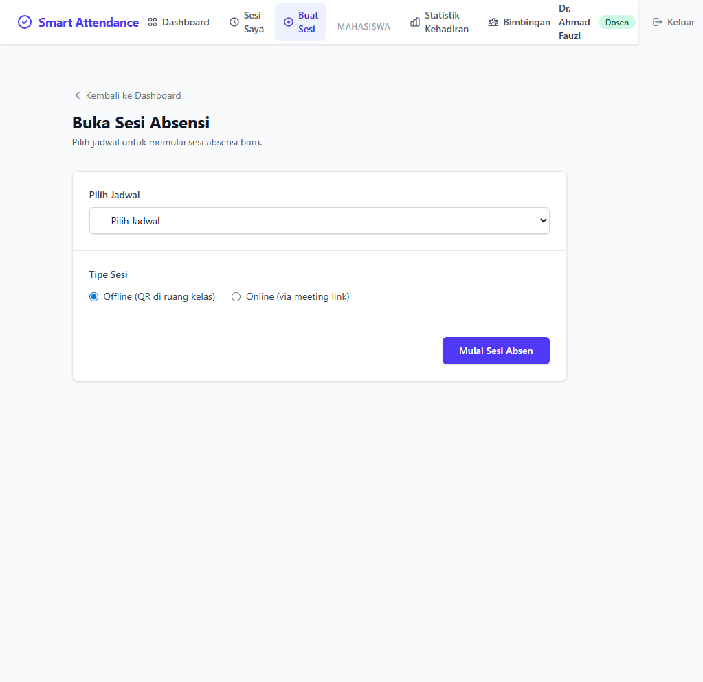
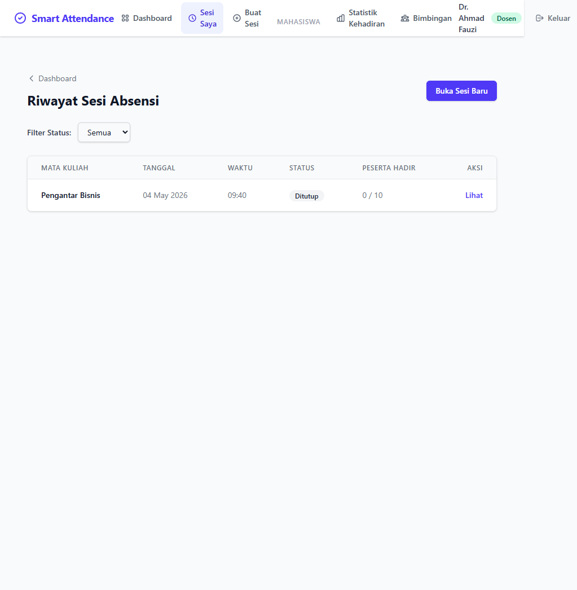
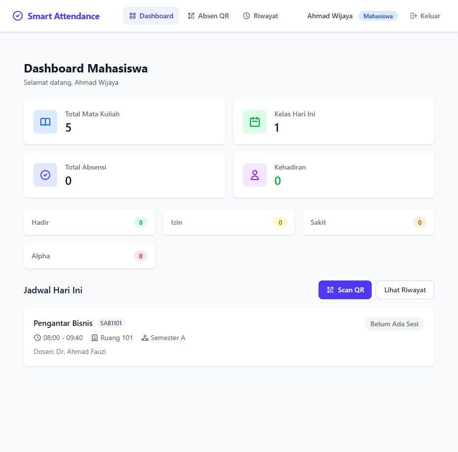
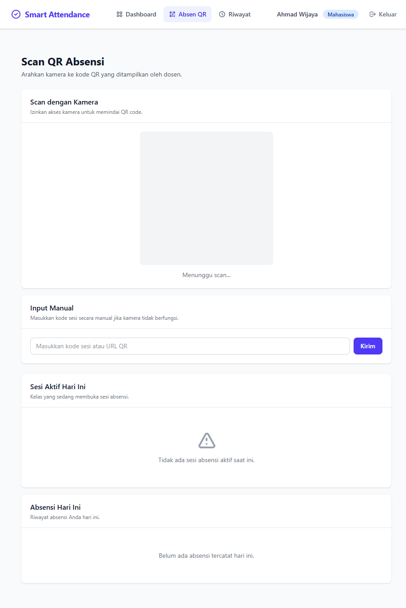
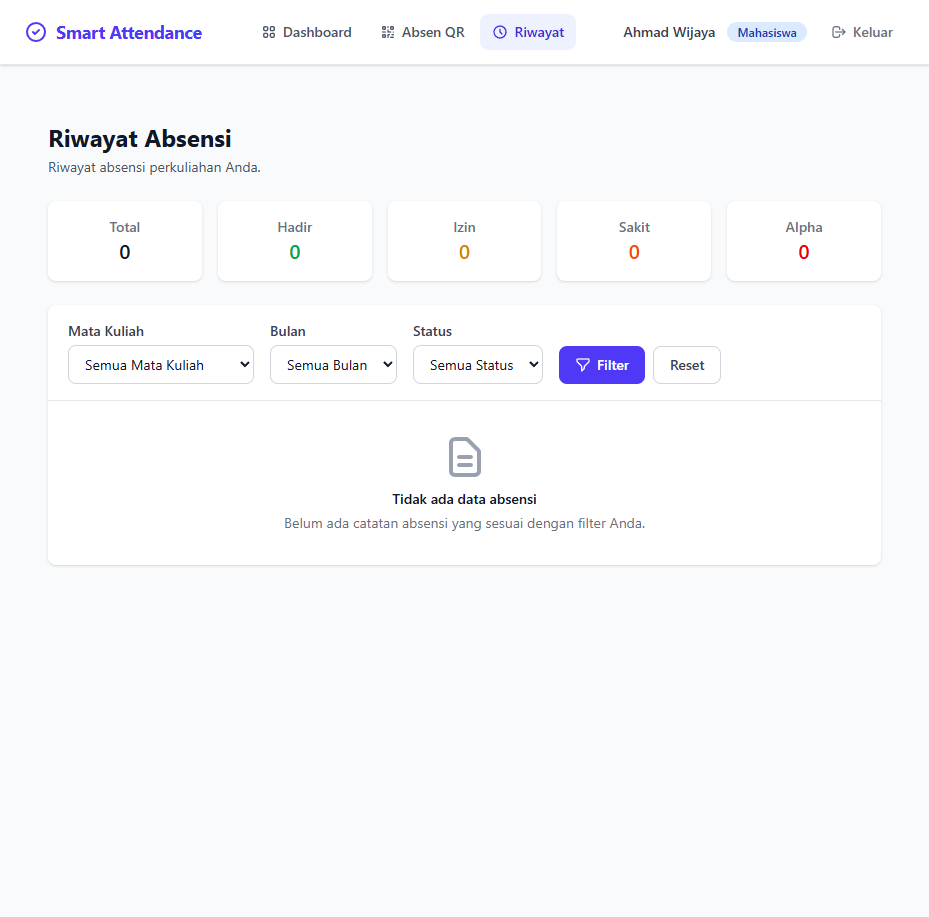
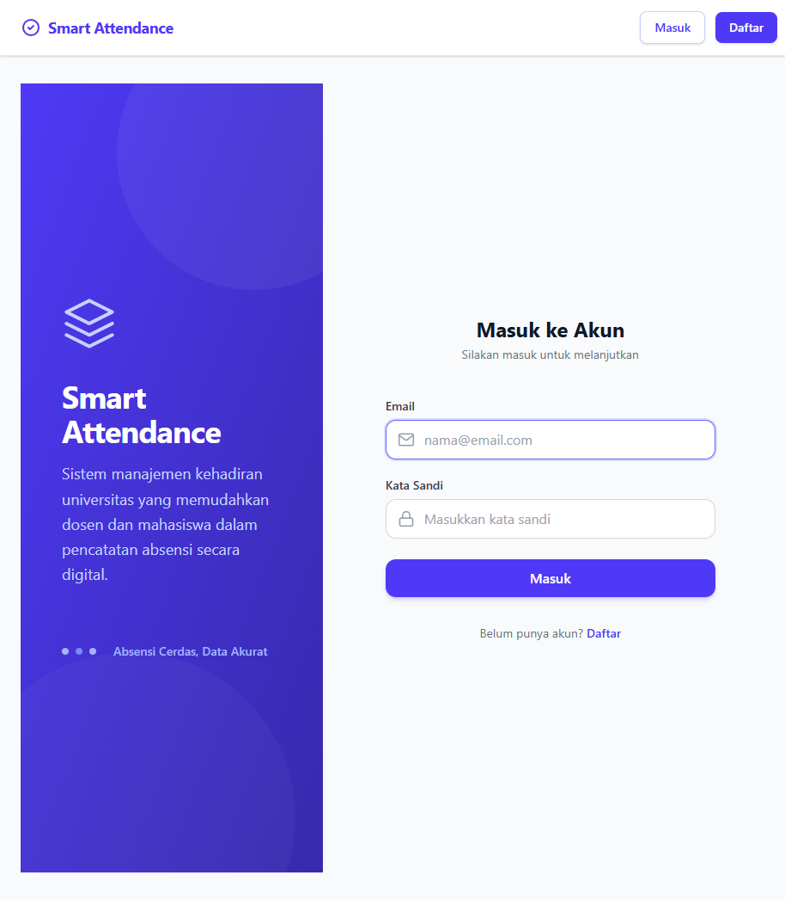

# Smart Attendance System

<div align="center">

<!-- Hero Banner SVG -->


<p><strong>Sistem Absensi Hybrid (Online + Offline) untuk Perkuliahan</strong></p>
<p><em>Dibangun dengan Laravel, QR Code, dan Analitik Real-Time</em></p>

[](https://laravel.com)
[](https://php.net)
[](https://tailwindcss.com)
[](https://postgresql.org)

</div>

---

## Daftar Isi

- [Fitur](#fitur)
- [Teknologi](#teknologi)
- [Cara Install Cepat](#cara-install-cepat)
- [Cara Install Manual](#cara-install-manual)
- [Konfigurasi](#konfigurasi)
- [Panduan Penggunaan](#panduan-penggunaan)
  - [Admin](#admin)
  - [Dosen](#dosen)
  - [Mahasiswa](#mahasiswa)
- [Dokumentasi API](#dokumentasi-api)
- [Screenshots](#screenshots)
- [Pengembangan](#pengembangan)
- [Berkontribusi](#berkontribusi)
- [Lisensi](#lisensi)

---

## Fitur

### Absensi Hybrid
- **Mode Offline**: Dosen menampilkan QR Code dinamis di proyektor. Mahasiswa scan pakai kamera HP.
- **Mode Online**: Dosen membuat sesi dengan link meeting (Zoom/Google Meet). Mahasiswa bisa langsung join.
- **Auto Tutup**: Sesi otomatis tertutup setelah 15 menit atau lewat command terjadwal.

### Multi-Role
- **Admin**: Dashboard lengkap, analitik, kelola user, mata kuliah, jadwal, dan pendaftaran.
- **Dosen**: Buat sesi, lihat kehadiran real-time, export CSV, kelola rekaman absensi mahasiswa.
- **Mahasiswa**: Scan QR untuk kuliah offline, join link meeting untuk online, lihat riwayat kehadiran.

### Analitik Real-Time
- Trend kehadiran per jurusan
- Kehadiran per semester
- Grafik trend 30 hari
- Tingkat kehadiran per mata kuliah

### REST API
- Autentikasi token (Laravel Sanctum)
- Endpoint untuk integrasi aplikasi mobile
- Rate limiting untuk produksi

---

## Teknologi

| Layer | Teknologi |
|-------|-----------|
| Backend | Laravel 13.x (PHP 8.3+) |
| Frontend | Blade + Tailwind CSS 4.x + Vite |
| Database | PostgreSQL 15+ |
| Auth | Laravel Sanctum (API) + Session (Web) |
| QR Scanner | html5-qrcode (browser-based) |
| Grafik | Chart.js 4.x |
| Queue | Database (default) |

---

## Cara Install Cepat

### Prasyarat

- PHP 8.3+ dengan ekstensi: `pgsql`, `mbstring`, `openssl`, `pdo`, `tokenizer`, `xml`, `ctype`, `json`, `bcmath`, `fileinfo`, `curl`
- PostgreSQL 15+
- Composer 2.x
- Node.js 20+ & npm 10+
- Git

### Install Sekali Klik

```bash
curl -sSL https://raw.githubusercontent.com/sfxcms/smart-attendance/main/install.sh | bash
```

**Atau langkah-demi-langkah:**

```bash
git clone https://github.com/sfxcms/smart-attendance.git
cd smart-attendance
php install.php
```

Script `install.php` akan:
1. Cek versi PHP & PostgreSQL
2. Install dependensi Composer
3. Install dependensi npm & build asset
4. Buat `.env` dari `.env.example`
5. Generate application key
6. Jalankan migration & seeder
7. Buat akun admin pertama
8. Cetak kredensial login

---

## Cara Install Manual

### 1. Clone & Masuk Direktori

```bash
git clone https://github.com/sfxcms/smart-attendance.git
cd smart-attendance
```

### 2. Install Dependensi PHP

```bash
composer install --no-dev --optimize-autoloader
```

Untuk pengembangan:
```bash
composer install
```

### 3. Install Dependensi Frontend & Build

```bash
npm install
npm run build
```

Untuk pengembangan dengan hot reload:
```bash
npm run dev
```

### 4. Konfigurasi Environment

```bash
cp .env.example .env
php artisan key:generate
```

Edit `.env` dengan kredensial database kamu:

```env
DB_CONNECTION=pgsql
DB_HOST=127.0.0.1
DB_PORT=5432
DB_DATABASE=smart_attendance
DB_USERNAME=postgres
DB_PASSWORD=password_kamu
```

### 5. Setup Database

```bash
# Buat database PostgreSQL
createdb smart_attendance

# Jalankan migration
php artisan migrate

# (Opsional) Seed data demo
php artisan db:seed
```

### 6. Link Storage

```bash
php artisan storage:link
```

### 7. Queue Worker (untuk produksi)

```bash
php artisan queue:work
```

### 8. Schedule (Auto-Tutup Sesi)

Tambahkan ke crontab server:

```bash
* * * * * cd /path/to/smart-attendance && php artisan schedule:run >> /dev/null 2>&1
```

Atau jalankan secara lokal:
```bash
php artisan schedule:work
```

### 9. Jalankan Aplikasi

```bash
php artisan serve
```

Akses di `http://localhost:8000`

---

## Konfigurasi

### Akun Admin Default

Jika kamu menjalankan seeder, admin default adalah:

| Field | Value |
|-------|-------|
| Email | `admin@university.ac.id` |
| Password | `password` |

> **Penting**: Ganti password ini segera setelah login pertama.

### Masa Berlaku Sesi

Sesi berlaku selama **15 menit** secara default. Ubah di `app/Http/Controllers/Dosen/SessionController.php`:

```php
'expires_at' => now()->addMinutes(15), // Ubah 15 sesuai kebutuhan
```

### Rate Limiting API

Endpoint API memiliki rate limiting. Ubah di `routes/api.php`:

```php
->middleware('throttle:60,1') // 60 request per menit
```

---

## Panduan Penggunaan

### Admin

Setelah login sebagai admin, kamu bisa:

1. **Dashboard** — Lihat statistik dan grafik keseluruhan
2. **Mata Kuliah** — Kelola mata kuliah dan tetapkan dosen pengajar
3. **Jurusan** — Kelola jurusan akademik
4. **Jadwal** — Buat jadwal kuliah (hari, jam, ruang)
5. **Pengguna** — Buat/edit akun admin, dosen, dan mahasiswa
6. **Pendaftaran** — Daftarkan mahasiswa ke jurusan/semester
7. **Mahasiswa** — Lihat status pendaftaran mahasiswa
8. **Analitik** — Analitik kehadiran lengkap dengan grafik

### Dosen

1. **Login** — Akses dashboard dosen
2. **Dashboard** — Lihat jadwal hari ini dan sesi aktif
3. **Buat Sesi** — Pilih jadwal, pilih mode:
   - **Offline**: Tampilkan QR Code untuk mahasiswa scan
   - **Online**: Berikan link meeting (Zoom/Google Meet)
4. **Lihat Sesi** — Pantau kehadiran real-time, export ke CSV
5. **Tutup Sesi** — Tutup sesi secara manual
6. **Statistik Kehadiran** — Lihat statistik kehadiran mahasiswa

### Mahasiswa

1. **Login** — Lihat jadwal kuliah hari ini
2. **Scan QR** — Untuk sesi offline:
   - Izinkan akses kamera
   - Scan QR Code yang ditampilkan dosen
   - Atau masukkan kode sesi manual
3. **Sesi Online** — Untuk sesi online:
   - Klik link **Buka Meeting** langsung
   - Kehadiran tercatat otomatis
4. **Riwayat** — Lihat riwayat kehadiran lengkap dengan filter (mata kuliah, bulan, status)

---

## Dokumentasi API

### Autentikasi

#### Login
```http
POST /api/login
Content-Type: application/json

{
  "email": "mahasiswa@example.com",
  "password": "password"
}
```

Response:
```json
{
  "success": true,
  "token": "1|xxxxxxxxxxxxxxxxxxxx",
  "user": { ... }
}
```

#### Logout
```http
POST /api/logout
Authorization: Bearer {token}
```

### Endpoint Mahasiswa

| Method | Endpoint | Deskripsi |
|--------|----------|-----------|
| GET | `/api/schedules` | Jadwal kuliah hari ini |
| POST | `/api/attendance/scan` | Scan QR code |
| GET | `/api/attendance/history` | Riwayat kehadiran |

### Endpoint Dosen

| Method | Endpoint | Deskripsi |
|--------|----------|-----------|
| GET | `/api/dosen/sessions` | Daftar sesi |
| POST | `/api/dosen/sessions` | Buat sesi baru |
| GET | `/api/dosen/sessions/{id}/attendance` | Kehadiran sesi |
| POST | `/api/dosen/sessions/{id}/close` | Tutup sesi |
| GET | `/api/dosen/courses` | Mata kuliah saya |
| GET | `/api/dosen/courses/{id}/schedules` | Jadwal mata kuliah |

### Contoh Scan QR

```http
POST /api/attendance/scan
Authorization: Bearer {token}
Content-Type: application/json

{
  "qr_data": "http://localhost/attendance/scan/1?token=qr_..."
}
```

---

## Screenshots

### 👑 Panel Admin

| Dashboard | Analitik | Manajemen Mata Kuliah |
|:----------:|:----------:|:---------------------:|
|  |  |  |

### 👨‍🏫 Panel Dosen

| Dashboard | Buat Sesi (Offline/Online) | Daftar Sesi |
|:----------:|:--------------------------:|:-----------:|
|  |  |  |

### 👨‍🎓 Panel Mahasiswa

| Dashboard | Scan QR / Online | Riwayat Kehadiran |
|:----------:|:----------------:|:-----------------:|
|  |  |  |

### 🔐 Halaman Login



---

## Pengembangan

### Menjalankan Tes

```bash
php artisan test
```

### Gaya Kode

Proyek ini mengikuti standar PSR-12.

```bash
vendor/bin/pint
```

### Perintah Berguna

```bash
# Bersihkan semua cache
php artisan optimize:clear

# Cek sesi kadaluarsa secara manual
php artisan app:expire-sessions

# Refresh database dengan seeder
php artisan migrate:fresh --seed
```

---

## Berkontribusi

Kontribusi sangat diterima! Silakan ikuti langkah-langkah ini:

1. Fork repository
2. Buat branch fitur kamu (`git checkout -b feature/FiturKerenn`)
3. Commit perubahan (`git commit -m 'Tambah fitur keren'`)
4. Push ke branch (`git push origin feature/FiturKerenn`)
5. Buka Pull Request

Jangan lupa update tes sesuai perubahan.

---

## Lisensi

Proyek ini adalah open-source dengan lisensi MIT.

---

## Terima Kasih

- Dibangun dengan [Laravel](https://laravel.com)
- Styled dengan [Tailwind CSS](https://tailwindcss.com)
- QR scanning oleh [html5-qrcode](https://github.com/mebjas/html5-qrcode)
- Grafik oleh [Chart.js](https://www.chartjs.org)

---

## Dukungan

<div align="center">

⭐ Jika proyek ini bermanfaat, jangan lupa kasih star di GitHub!

[](https://github.com/sfxcms/smart-attendance)
[](https://github.com/sfxcms/smart-attendance)
[](https://github.com/sfxcms/smart-attendance/issues)

Untuk masalah dan permintaan fitur, silakan gunakan [GitHub Issues](https://github.com/sfxcms/smart-attendance/issues).

</div>
